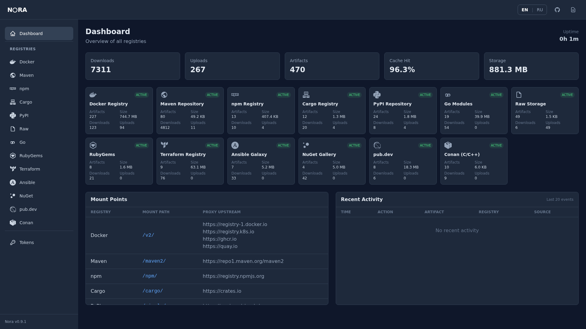

# NORA

**The artifact registry that grows with you.** Starts with `docker run`, scales with your needs.

```bash
docker run -d -p 4000:4000 -v nora-data:/data getnora/nora:latest
```

Open [http://localhost:4000/ui/](http://localhost:4000/ui/) — your registry is ready.

<p align="center">
  
</p>

## Why NORA

- **Zero-config** — single binary, no database, no dependencies. `docker run` and it works.
- **13 registries** — Docker, Maven, npm, PyPI, Cargo, Go, Raw, RubyGems, Terraform, Ansible Galaxy, NuGet, Pub (Dart/Flutter), Conan (C/C++).
- **Secure by default** — [OpenSSF Scorecard](https://scorecard.dev/viewer/?uri=github.com/getnora-io/nora), signed releases, SBOM, fuzz testing, 1200+ tests.

[](https://github.com/getnora-io/nora/releases)
[](LICENSE)
[](https://artifacthub.io/packages/helm/nora/nora)
[](https://hub.docker.com/r/getnora/nora)

**< 27 MB** binary | **< 50 MB** RAM idle | **3s** startup | **13** registries

## Supported Registries

| Registry | Mount Point | Upstream Proxy | Auth |
|----------|------------|----------------|------|
| Docker Registry v2 | `/v2/` | Docker Hub, GHCR, any OCI, Helm OCI | ✓ |
| Maven | `/maven2/` | Maven Central, custom | ✓ |
| npm | `/npm/` | npmjs.org, custom | ✓ |
| Cargo | `/cargo/` | crates.io | ✓ |
| PyPI | `/simple/` | pypi.org, custom | ✓ |
| Go Modules | `/go/` | proxy.golang.org, custom | ✓ |
| Raw files | `/raw/` | — | ✓ |
| RubyGems | `/gems/` | rubygems.org | ✓ |
| Terraform | `/terraform/` | registry.terraform.io | ✓ |
| Ansible Galaxy | `/ansible/` | galaxy.ansible.com | ✓ |
| NuGet | `/nuget/` | api.nuget.org | ✓ |
| Pub (Dart/Flutter) | `/pub/` | pub.dev | ✓ |
| Conan (C/C++) | `/conan/` | ConanCenter | ✓ |

> **Helm charts** work via the Docker/OCI endpoint — `helm push`/`pull` with `--plain-http` or behind TLS reverse proxy.

## Quick Start

### Docker (Recommended)

```bash
docker run -d -p 4000:4000 -v nora-data:/data getnora/nora:latest
```

### Binary

```bash
# x86_64
curl -fsSL https://github.com/getnora-io/nora/releases/latest/download/nora-linux-amd64 -o nora

# ARM64 (Raspberry Pi, Graviton, Apple Silicon VMs)
curl -fsSL https://github.com/getnora-io/nora/releases/latest/download/nora-linux-arm64 -o nora

chmod +x nora && ./nora
```

`./nora` listens on `127.0.0.1:4000`. To expose it on a network, set the bind
address and the public URL clients should use for download links:

```bash
NORA_HOST=0.0.0.0 NORA_PUBLIC_URL=https://registry.example.com ./nora
```

### Kubernetes (Helm)

```bash
helm repo add nora https://getnora-io.github.io/helm-charts
helm install nora nora/nora
```

### From Source

```bash
cargo install nora-registry
nora
```

## Usage

```bash
# Docker
docker tag myapp:latest localhost:4000/myapp:latest
docker push localhost:4000/myapp:latest

# npm
npm config set registry http://localhost:4000/npm/
npm publish

# Go
GOPROXY=http://localhost:4000/go go get golang.org/x/text@latest
```

See [full documentation](https://getnora.dev) for all registries.

## Features

- **Web UI** — dashboard with search, browse, i18n (EN/RU)
- **Proxy & Cache** — transparent proxy to upstream registries with local cache
- **Curation** — blocklist, allowlist, namespace isolation, integrity verification, min-release-age filter, digest quarantine
- **Token RBAC** — read/write/admin roles, expiry tracking, deferred last_used flush
- **Mirror CLI** — offline sync for air-gapped environments (`nora mirror`)
- **Backup & Restore** — `nora backup` / `nora restore`
- **S3 Storage** — AWS S3, Ceph RGW, any S3-compatible backend
- **Prometheus Metrics** — `/metrics` endpoint, [Grafana dashboard](MONITORING.md)
- **Rate Limiting** — configurable per-endpoint rate limits

## Configuration

NORA works out of the box. For advanced setup — auth, S3, retention, curation — see [getnora.dev/configuration](https://getnora.dev/configuration/settings/).

```bash
# Auth
docker run -d -p 4000:4000 \
  -v nora-data:/data \
  -v ./users.htpasswd:/data/users.htpasswd \
  -e NORA_AUTH_ENABLED=true \
  getnora/nora:latest
```

```bash
# Curation — block packages younger than 7 days
docker run -d -p 4000:4000 \
  -v nora-data:/data \
  -e NORA_CURATION_MODE=enforce \
  -e NORA_CURATION_MIN_RELEASE_AGE=7d \
  -e NORA_CURATION_ALLOWLIST_PATH=/data/allowlist.json \
  getnora/nora:latest
```

## Performance

| Metric | NORA | Nexus | JFrog |
|--------|------|-------|-------|
| Startup | < 3s | 30-60s | 30-60s |
| Memory | < 50 MB idle | 2-4 GB | 2-4 GB |
| Binary | < 27 MB | 600+ MB | 1+ GB |

## Roadmap

- ~~Mirror CLI~~ ✅ v0.4.0
- ~~Garbage Collection & Retention~~ ✅ v0.6.0
- ~~Helm Chart~~ ✅ v0.6.1
- ~~Signed releases & SBOM~~ ✅ v0.6.4
- ~~Curation layer & 13 registry formats~~ ✅ v0.7.0
- ~~Min Release Age~~ ✅ v0.7.1
- ~~Hash Pin Store, auth rate limiting, Cache-Control~~ ✅ v0.8.0
- ~~Outbound proxy, structured audit log~~ ✅ v0.8.3
- ~~Circuit breaker, OIDC, hot reload, arm64, streaming uploads~~ ✅ v0.9.0
- ~~NuGet V3 stabilization, Cargo ETag, 1049 tests~~ ✅ v0.9.1
- ~~Prometheus metrics, Ansible Galaxy v3, security fixes, 1086 tests~~ ✅ v0.9.2
- ~~Security hardening, null byte protection, config refactor, 1204 tests~~ ✅ v0.9.3
- **Image Signing Policy** — cosign verification on upstream pulls
- **Semver contract** — stable API, configuration format, and storage layout

See [ROADMAP.md](ROADMAP.md) for the full roadmap and [CHANGELOG.md](CHANGELOG.md) for release history.

## Security & Trust

[](https://scorecard.dev/viewer/?uri=github.com/getnora-io/nora)
[](https://www.bestpractices.dev/projects/12207)
[](https://github.com/getnora-io/nora/actions/workflows/ci.yml)
[](https://github.com/getnora-io/nora/actions)

See [SECURITY.md](SECURITY.md) for vulnerability reporting.

## Documentation

Full documentation: **https://getnora.dev**

## Author

Created and maintained by [Pavel Volkov](https://github.com/devitway)

[](https://getnora.dev)
[](https://t.me/getnora)
[](https://github.com/getnora-io/nora/stargazers)

## Contributing

NORA welcomes contributions! See [CONTRIBUTING.md](CONTRIBUTING.md) for guidelines.

## License

MIT License — see [LICENSE](LICENSE)

Copyright (c) 2026 The NORA Authors
